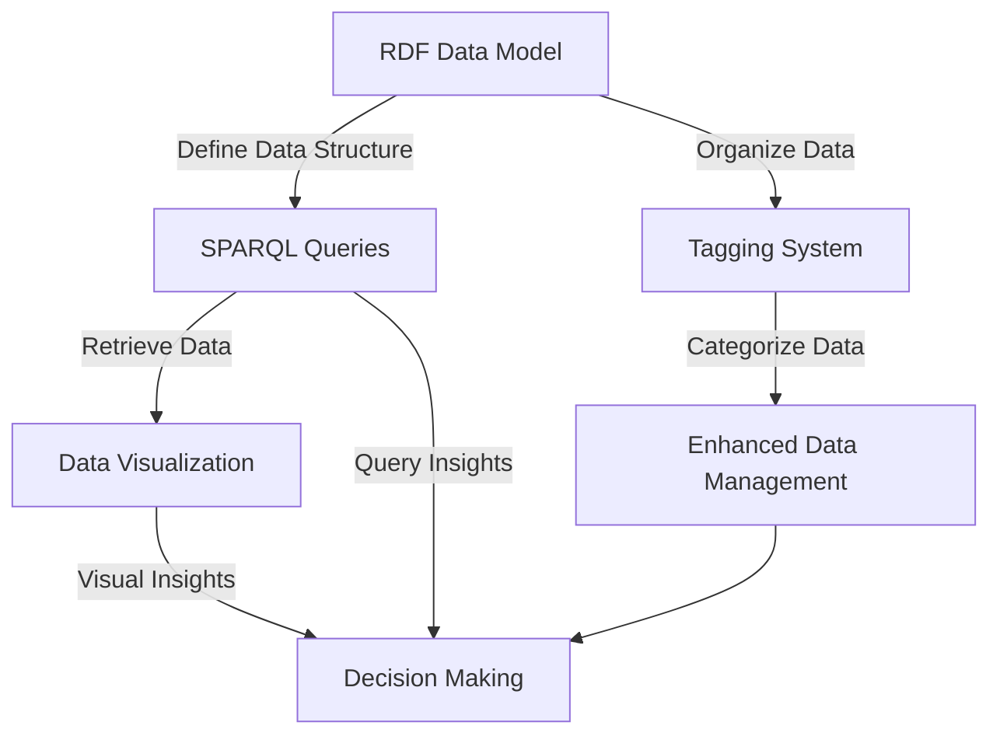

# A Story of Data Discovery and Management with RDF and SPARQL

Welcome to an in-depth journey into the world of RDF (Resource Description Framework) and SPARQL, the query language designed for navigating the complex web of data. This guide explores the implementation of RDF and SPARQL within the realm of data discovery and management, specifically focusing on their application in inventory management systems.

## Introduction to RDF and SPARQL

RDF is a standard model for data interchange on the web, enabling the structured representation of information. It lays the foundation for a universally understandable web of data, where each piece of data is meticulously cataloged, much like books in a vast library. SPARQL, on the other hand, acts as the navigator within this library, offering powerful query capabilities to retrieve and analyze data efficiently.

### Embarking on the RDF Journey

RDF allows for the definition of data in a way that is universally understandable, structuring the web of data through subject-predicate-object triples. This structure not only facilitates the easy discovery of data but also enables the detailed description of relationships between data points.

### Navigating with SPARQL

SPARQL's role in this ecosystem is to provide the means to explore and retrieve data through its query capabilities. Whether for simple lookups or complex data joins across various datasets, SPARQL enables precise and efficient data retrieval.

## Enhancing Data Management with RDF

In the context of inventory management, RDF offers several advantages:

- **Enhanced Data Interoperability**: By representing data in RDF's standardized format, it ensures that data can be shared and understood across different systems, facilitating integration with external data sources.
- **Richer Data Representation**: RDF's graph-based data model allows for a detailed representation of items, their attributes, and relationships, offering a deeper understanding of inventory items and their connections.
- **Advanced Query Capabilities**: Through SPARQL, users can perform complex queries that navigate the relationships between items, providing insights that traditional databases may not offer.

## Tagging System in RDF

Tags within RDF serve to categorize and manage data effectively, encompassing:

- **Semantic Tags**: Highlight the core themes of the data.
- **Discovery Tags**: Facilitate connections between disparate datasets.
- **Access Tags**: Ensure data privacy and security.
- **Lifecycle Tags**: Narrate the story of data from inception to conclusion.

### NOTE - Metadata Categories

#### Business/Semantic/Descriptive/Contextual Metadata:

* Provides business context, meaning, definitions, policies, and governance around data assets. Examples: Business terms, classification taxonomies, data retention rules, compliance policies, data stewardship info.
* RDF can be used to represent business/semantic metadata in a flexible, extensible way using subject-predicate-object triples to describe data concepts, relationships and rules.

  Covers Data lifecycle also
    - Data source and creation process
    - Update schedules and frequencies
    - Data ownership and stewardship
    - Data retention and archival policies
    - Metadata based Data quality rules
    - Usage tracking and access controls
    - etc

#### Technical/Structural/Format/Physical Metadata:

* Describes the technical implementation details of data - formats, types, models, schemas, storage locations etc. Examples: Data types, database schemas, ETL logic, data profiles.
* RDF can capture some technical metadata by modeling the structure and serialization formats of datasets.

#### Operational/Process/Execution Metadata:

* Tracks the processes operating on data - job schedules, run logs, monitoring data, audit trails. Examples: Refresh schedules, system logs, performance metrics.
* RDF is less commonly used for operational metadata compared to logs/audit trails, but could potentially model process flows and execution data.

#### Social/Collaborative/User-Generated Metadata:

* Crowdsourced metadata from user annotations, comments, ratings providing interpretation and context. Examples: User annotations, issue reports, knowledge forums.
* RDF allows capturing social metadata by modeling user-generated annotations and tagging data using flexible schema-less graphs.

In summary, RDF excels at representing semantic/business metadata and social metadata due to its flexible graph data model using subject-predicate-object triples. It can also capture some technical metadata structure. However, for detailed operational/process metadata, other specialized logging/monitoring tools are more commonly used.


### Code Snippet: RDF Triple Example

```python
from rdflib import Graph, Literal, RDF, URIRef
# Create a new graph
g = Graph()

# Create an RDF triple with subject, predicate, and object
subject = URIRef("http://example.org/item123")
predicate = RDF.type
object = URIRef("http://example.org/InventoryItem")

# Add the triple to the graph
g.add((subject, predicate, object))
```

This snippet demonstrates how to create an RDF triple and add it to a graph, representing the foundation of data structuring in RDF.

## Proof-of-Concept Demonstration

The notebook showcases a proof-of-concept for leveraging RDF in Master Data Management (MDM), utilizing open-source libraries to load, query, and visualize RDF data. It focuses on enriching a data mesh catalog with additional metadata, such as schemas, glossaries, and ownership information.

### Design and Architecture Diagram

The following mermaid diagram illustrates the project's design and architecture, showcasing the flow from RDF data modeling to SPARQL querying and data categorization through tagging.



This diagram emphasizes the comprehensive process from data structuring with RDF, querying with SPARQL, organizing data through a tagging system, to the ultimate goal of enhanced data management and informed decision-making.

## Conclusion

"A Story of Data Discovery and Management with RDF and SPARQL" delves into the transformative potential of RDF and SPARQL in data management practices. By structuring data in a universally understandable format and navigating this data with powerful querying capabilities, organizations can achieve greater interoperability, detailed data representation, and efficient data management.
