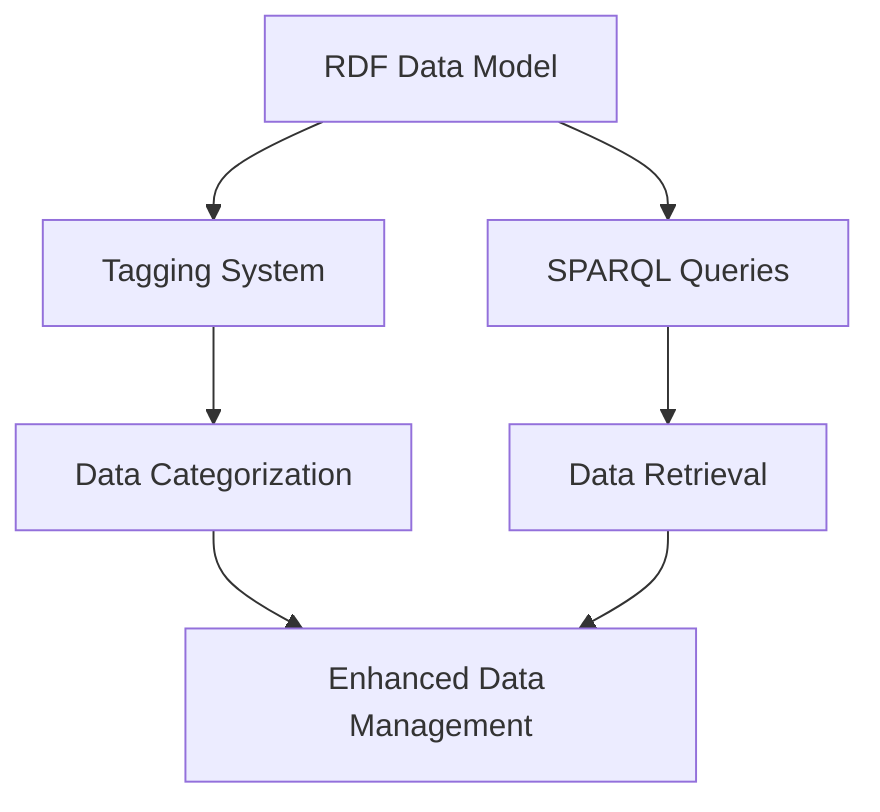

# A Story of Data Discovery and Management with RDF and SPARQL

Welcome to the exploration of how the Resource Description Framework (RDF) and SPARQL can revolutionize data discovery and management. This project delves into the application of these technologies in inventory management, demonstrating a more structured and interconnected approach to data handling.

## Introduction

RDF is a standard model for data interchange on the web, offering a flexible and universally understandable structure for data. SPARQL, the query language for RDF, acts as a powerful tool for navigating and retrieving data within this structured framework. Together, they enable a rich, interconnected data landscape that is easily navigable and queryable.

## RDF's Role in Inventory Management

In the realm of inventory management, RDF provides a means to describe items, their attributes, and relationships comprehensively. It supports a graph-based data model, allowing for a more expressive representation of data points and their interconnections. This capability enhances data interoperability, facilitates richer data representation, and enables advanced query capabilities, making it particularly suited for managing complex inventory systems.

## Using SPARQL for Data Queries

SPARQL allows for precise data retrieval through its robust querying capabilities. It can perform simple lookups, complex joins, and navigate the relationships between data points, offering insights that traditional databases might struggle to provide. This project showcases SPARQL's utility in extracting detailed information from a RDF-based data model.

## Tagging in RDF

Tags play a crucial role in categorizing and managing data within RDF. They include:

- **Semantic Tags**: Highlight the core themes of the data.
- **Discovery Tags**: Facilitate the connection between disparate datasets.
- **Access Tags**: Ensure data privacy and security.
- **Lifecycle Tags**: Track the story of data from creation to conclusion.

These tags enhance data accessibility and understanding, contributing to a more organized and manageable data ecosystem.

## Proof-of-Concept Demonstration

This notebook presents a proof-of-concept for storytelling with RDF-based Master Data Management (MDM). It leverages open-source libraries to load, query, and visualize RDF data, focusing on enriching a data mesh catalog with comprehensive metadata. The examples and demonstrations provided offer a glimpse into the potential of RDF and SPARQL in transforming data discovery and management practices.

---

### Design and Architecture

Below is a mermaid diagram representing the project's design and architecture, illustrating the flow from data representation in RDF to querying with SPARQL and organizing data through tagging.

This diagram outlines the process of representing data using RDF, querying this data with SPARQL, and organizing it through a comprehensive tagging system, culminating in enhanced data management capabilities.

### Conclusion

The RDF-Based Tags project illustrates the power of RDF and SPARQL in creating a more interconnected and manageable data ecosystem. By implementing these technologies, organizations can achieve greater data interoperability, representation, and querying capabilities, leading to more informed decision-making and efficient data management practices.
